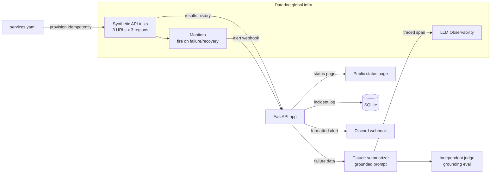

# StatusPack

StatusPack turns a set of real URLs into a public status page and an automated incident responder, using Datadog as the actual monitoring engine instead of a homegrown poller. It registers each URL as a Datadog Synthetic API test, lets Datadog's global infrastructure run the checks from multiple regions, and consumes the results and monitor alerts to render the page. When a check fails, an LLM summarizes the incident from the raw failure data, and a separate LLM-as-judge grades that summary to make sure it only states what the data actually supports.

The main design goal was to avoid rebuilding infrastructure Datadog already does well. Multi-region synthetic checks, result history, and alerting are Datadog's job here. The app only provisions the tests, reads back their results, and reacts to alert webhooks.

## What it does

* Provisions Datadog Synthetic tests from a `services.yaml` config. The provisioning script is idempotent, so re-running it updates existing tests instead of creating duplicates.
* Renders a public status page showing current status per service, uptime over the tracked window, and a timeline of past incidents pulled from a local SQLite log.
* Runs a Datadog Monitor per test that fires on failure and recovery, and forwards a formatted alert to a Discord webhook.
* On failure, sends the raw result data (status codes, latency series, failing regions, duration) to Claude with a prompt constrained to describe only what the data shows. The call is wrapped in the Datadog LLM Observability SDK, so it appears as a traced span with token count, cost, and latency.
* Grades each summary with an independent judge prompt that flags any claim not grounded in the failure data.

## Key decisions

* The summarizer and the judge are two separate LLM calls. A model grading its own output tends to rubber-stamp it, so the judge has to be independent for the eval to mean anything.
* The summarizer prompt is deliberately narrow. Something like "5 consecutive 503s from us-east over 6 minutes, latency rising from 210ms to 4.8s" is allowed; a guessed root cause like "database connection pool exhaustion" is not, unless the data shows it. An unverified root cause in an incident summary can send an on-call engineer down the wrong path during a real outage.
* Datadog runs the checks. Writing a custom poller would duplicate work Datadog already solves and make the monitoring layer decorative.

## Architecture



## Results

These numbers come from runs against a real Datadog org and are backed by committed artifacts under [`evidence/`](evidence/) and [`DEVLOG.md`](DEVLOG.md).

* 3 production services monitored across 3 AWS regions (us-east-1, eu-west-1, ap-southeast-1).
* A deliberately triggered failure was detected across all 3 regions in 1.6s and paged via monitor alert in about 30s.
* The status page reflected the real outage, dipping to 72.2% uptime and recovering.
* One traced incident summary used 670 tokens at $0.0076 and 4.22s on `claude-opus-5`.
* The grounding eval flagged 100% (9/9) of the deliberately hallucinated summaries at a 9.1% false-positive rate (1 of 11 grounded summaries wrongly flagged), over a 20-item labeled set.
* CI runs lint, format, and 40 unit tests.

## Running it

```bash
cp .env.example .env          # fill DD_API_KEY, DD_APP_KEY, ANTHROPIC_API_KEY
pip install -r requirements-dev.txt

python -m statuspack.provision          # create the Datadog synthetic tests
uvicorn statuspack.app:app --port 8000  # status page at http://localhost:8000
python -m statuspack.phase2_incident    # trigger a real failure and measure latency
python -m statuspack.phase4_summarize   # produce a traced LLM incident summary
python -m statuspack.phase5_eval        # run the grounding eval
pytest                                  # unit tests
```

## A stretch piece that was scoped out

Confidence-gated auto-remediation (Claude proposing a restart or rollback from a per-service allow-list, gated on both a confidence threshold and the judge confirming the reasoning is grounded) was deliberately left out of this build. It needs a hosting-provider API allow-list and human-in-the-loop approval before it should touch anything, and the honest version of this project only ever touches services you own.
